# Site Cabana

De incio clone o repositório o repositorio em algum local do computador

```bash
git clone https://github.com/DEV-COMPET/Cabana
```

# Pré-Requisitos

Duas ferramentas são necessárias para conseguirmos desenvolver nosso site:
- [xampp](https://www.apachefriends.org/pt_br/index.html)
- [wordpress](https://wordpress.org/download/)

*OBS: se atento(a) em que diretório o xampp e o wordpress*

# Banco de dados

Precisamos de um banco de dados para o site, no nosso caso já temos um pronto, so precisaremos importá-lo.

Execute o <code>XAMPP CONTROL PANEL</code> e habilite dois módulos
<p align="center">
    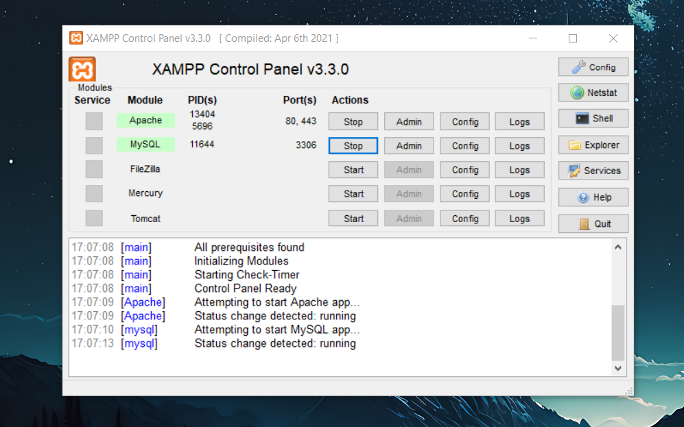
</p>

*OBS: caso uma delas de erro basta acessar o gerenciador de tarefas e finalizar o programa que estão rodando nas portas que os modulos requerem*

Após isso acesse o navegador e digite [localhost/phpmyadmin]()

<p align="center">
    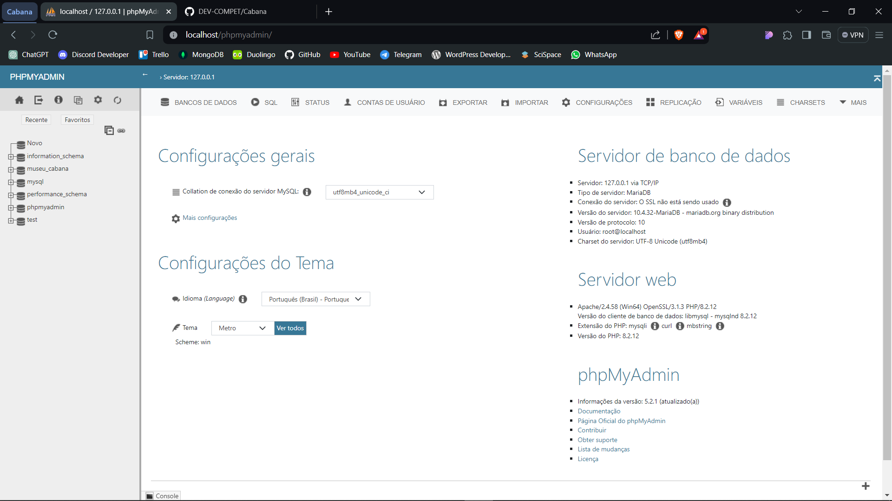
</p>

No painel a esquerda clique em novo e crie um banco de dados com a seguinte configuração

<p align="center">
    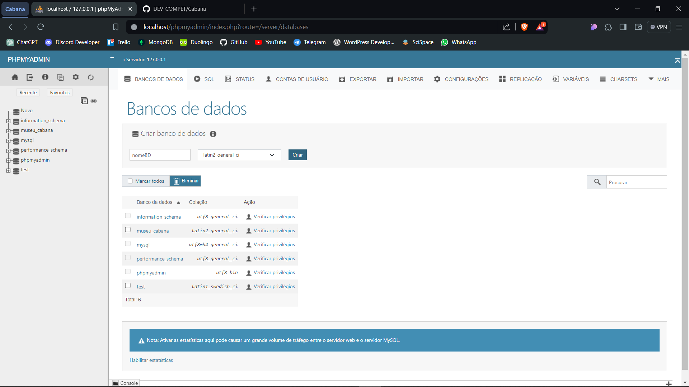
</p>

Após acesso pelo menu superior a aba importar e navegue até o banco de dados que baixou do repositório GITHUB

<p align="center">
    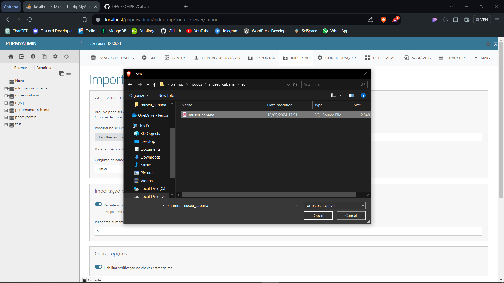
</p>

Arraste para baixo e importe

<p align="center">
    
</p>


# Wordpress

Ao baixar o wordpress terá um arquivo compactado, copie e cole dentro da pasta <code>htdocs</code>, que se encontrar dentro da pasta do <code>xampp</code> 

<p align="center">
    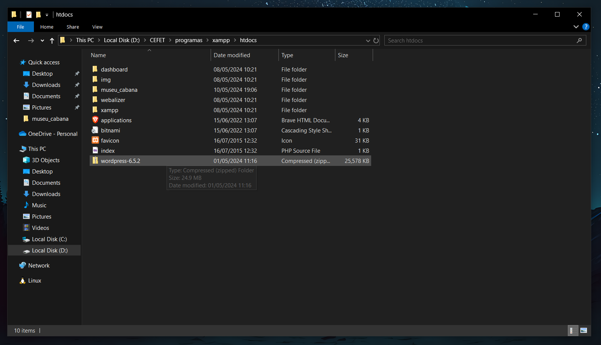
</p>

Descompacte o arquivo e renomeie a pasta para o <code>nome_do_seu_projeto</code>

<p align="center">
    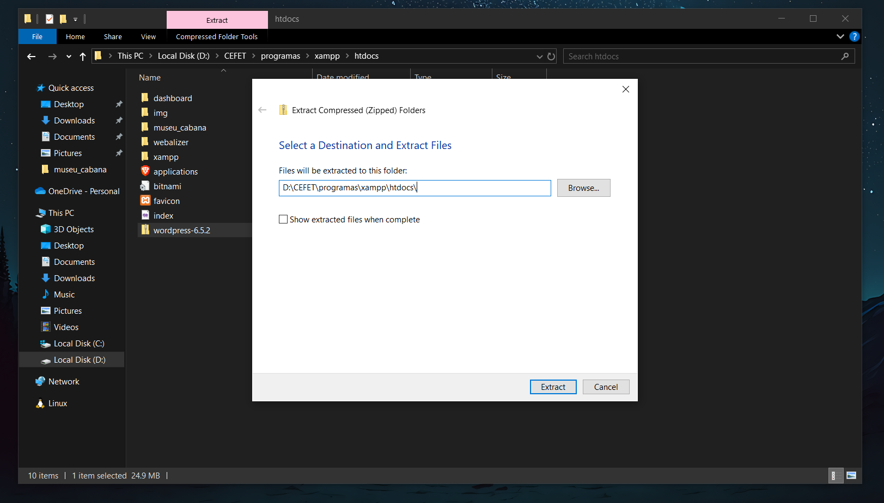
</p>


## Instalação WordPress

Acesse o navegador e digite [localhost/nome_do_seu_projeto]()

A seguinte tela aparecerá

<p align="center">
    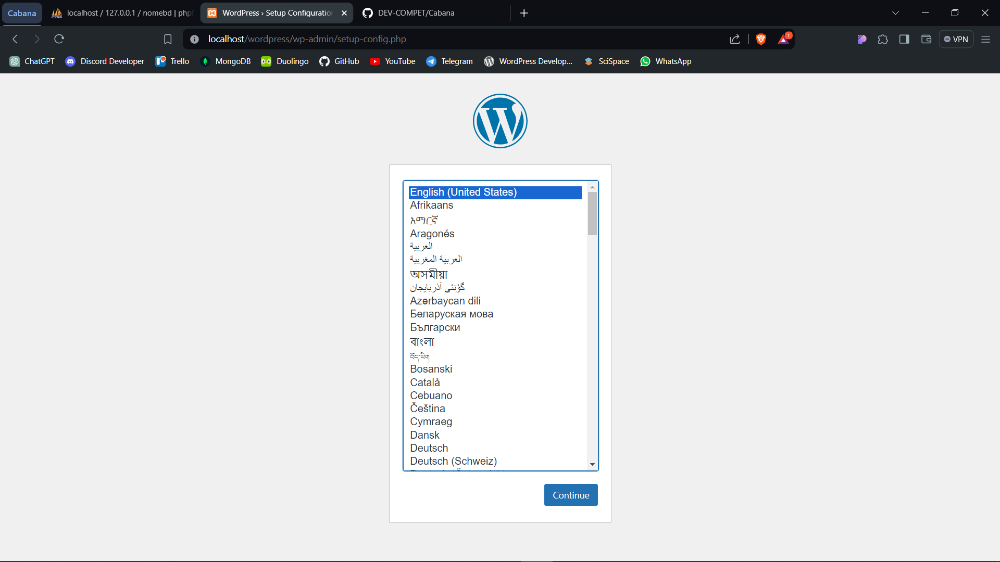
</p>

Selecione o idioma e clique em continuar. 

A seguinte tela aparecerá

<p align="center">
    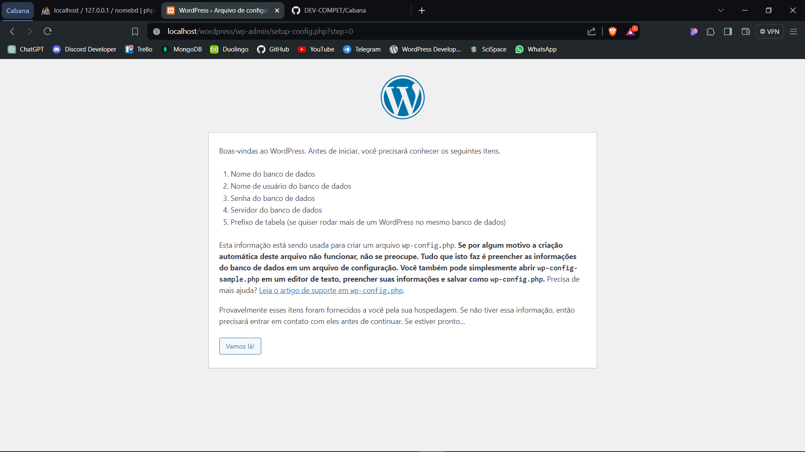
</p>

Na tela seguinte será configurar as informações do banco de dados (altere o nomedb pelo nome do banco de dados que criou)

<p align="center">
    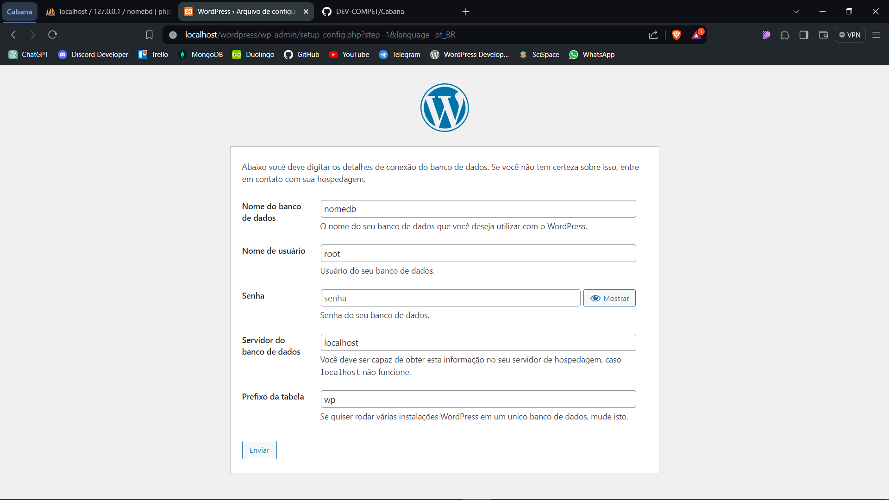
</p>

Avance e configure o nome do site, usuário e senha

<p align="center">
    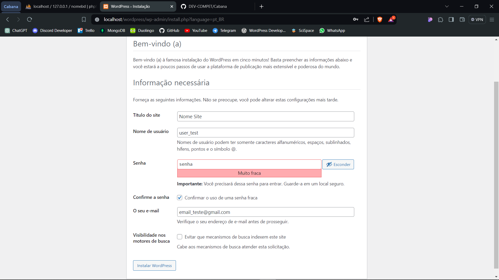
</p>

# Instalação completa

Após a instalação completa, será possível acessar o painel de controle do wordpress

<p align="center">
    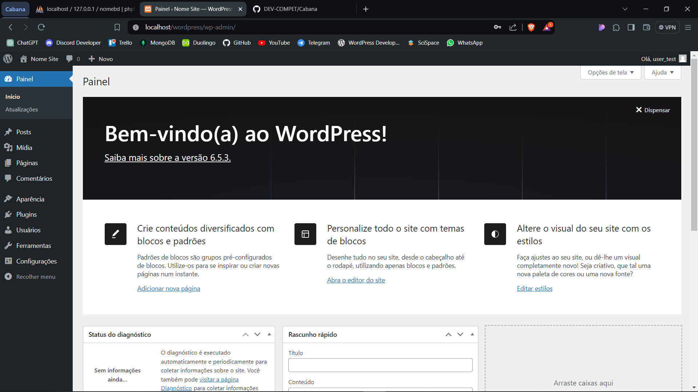
</p>

## Plugins

Vá até a aba de plugins e desinstale os dois que apareceram, após isso instale os seguintes plugins

<p align="center">
    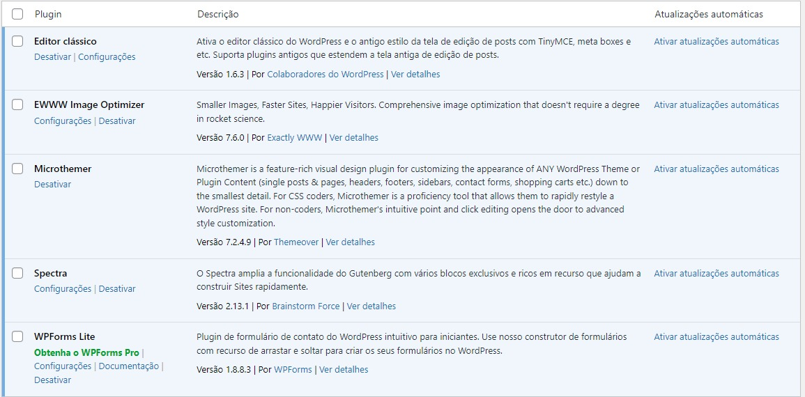
</p>


*OBS: Ative eles, pois serão necessários*

## Temas

Vá até a aba de aparência e entre na sessão temas, nela clique em adicionar tema e procure pelo tema <code>Astra</code> e instale. 

Depois procure na internet pelo astra child generator e baixe-o ([astra child generator](https://wpastra.com/child-theme-generator/)).

Volte até os temas do wordpress e adicione o tema que baixou

<p align="center">
    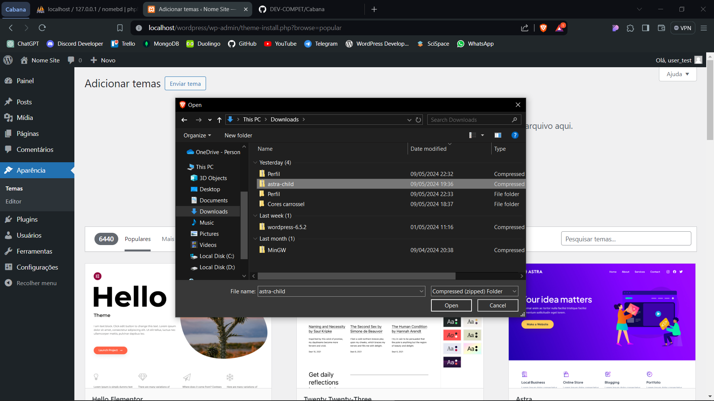
</p>

Após isso ative o tema e pronto, o site está pronto para ser desenvolvido